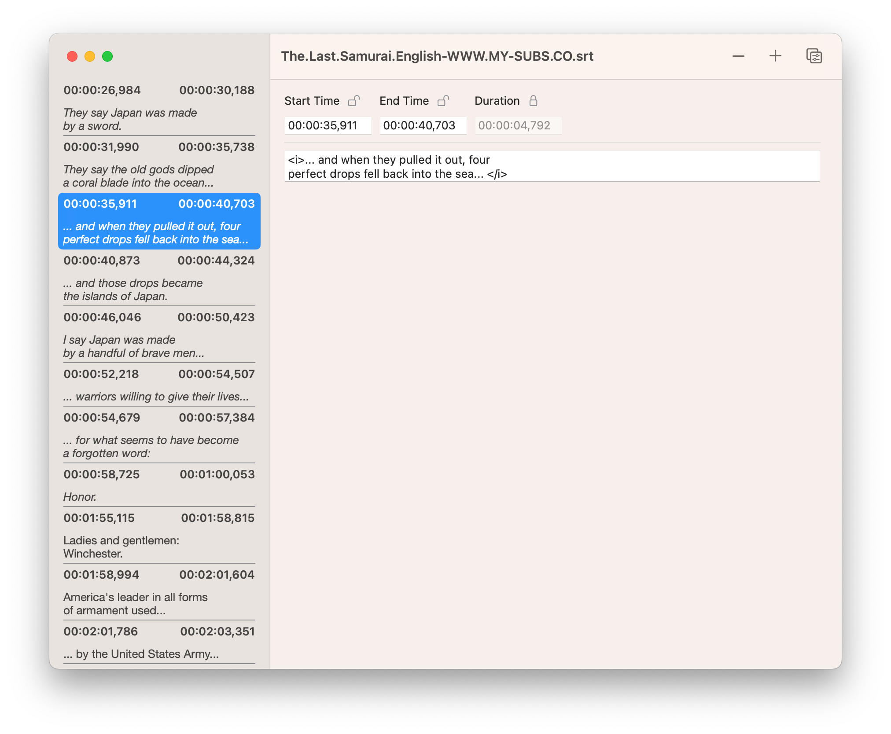
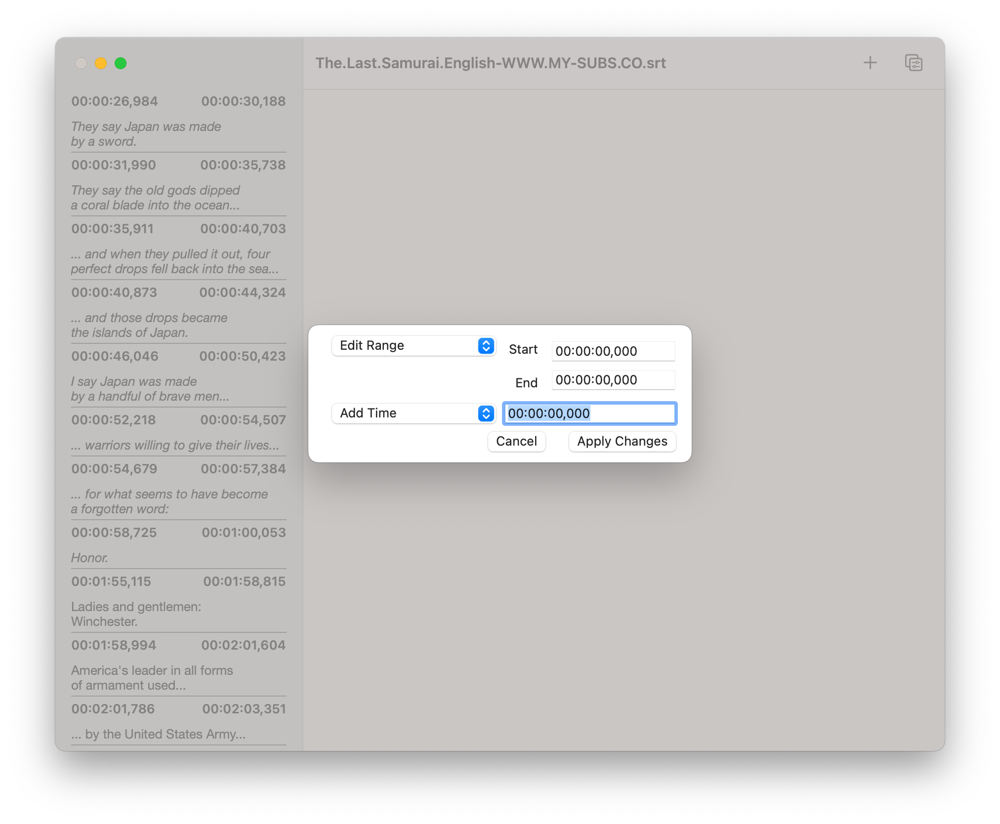

# Subtitle Editor
Edit Subtitles in the SubRip format (.srt files).

## Contents

- [Features](#features)
- [Installation](#installation)
- [Getting Started](#getting-started)
- [Contributing](#contributing)
- [Screenshots](#screenshots)
- [License](#license)

## Features

Subtitle Editor supports SubRip files (.srt) and supports the following featurees:

- Edit subtitle texts
- Support for formatting. Both angled brackets `<` and braces `{` are supported. The following tags are supported:
	* `b` Bold font (e.g. `<b>This is bold</b>` or `{b}This is bold{/b}`)
	* `i` Italic font (e.g. `<i>This is italic</i>`)
	* `u` Underlined text (e.g. `<u>This text is underlined</u>`
	* `font` Set the text color. Both html color names as well as hex color values are supported (e.g. `<font color="CornflowerBlue">Hello</font>` or `<font color="#6495ED">Hello</font>`)

## Installation
### System Requirements
Subtitle Editor requires macOS 12 (Monterey) or later.

### Installing Subtitle Editor
Download the latest release from GitHub. Drag the application into the Applications directory on your local computer.

## Development
Following these instructions will get you a copy of the code on your local machine for developing and testing purposes.

### Prerequisits
This project requires Xcode to be installed.

### Get the source code
Either download the source from the GitHub page or clone the repository:

```bash
git clone https://github.com/MichaelSeeberger/Subtitle-Editor.git
```

## Contributing
When contributing to this repository, please first discuss the change you wish to make via issue with the owners of this repository before making a change. This is to ensure that the same work is not done by multiple people.

### Not a Developer?
If you are not a developer, you can still contribute:

- Translate into another language. Contact me if you need help getting started!
- Create cool icons
- Give feedback (e.g. layout)
- Report bugs you have encountered
- Make feature requests

### Contribution Process
1. Fork the repository.
2. Make your change on a new branch
3. Make a pull request
4. Once your pull request has been reviewed, it will be merged into the main branch.

## Screenshots




## License
Copyright 2020 Michael Seeberger

This project is licensed under the Apache License 2.0. See the LICENSE and NOTICE files for details.


Licensed under the Apache License, Version 2.0 (the "License");
you may not use this file except in compliance with the License.
You may obtain a copy of the License at

[http://www.apache.org/licenses/LICENSE-2.0](http://www.apache.org/licenses/LICENSE-2.0)

Unless required by applicable law or agreed to in writing, software
distributed under the License is distributed on an "AS IS" BASIS,
WITHOUT WARRANTIES OR CONDITIONS OF ANY KIND, either express or implied.
See the License for the specific language governing permissions and
limitations under the License.
